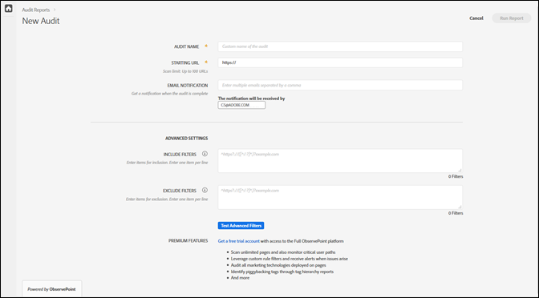

# 新しい監査の作成 {#create-a-new-audit}

>[!NOTE]
>
>ユーザーは、一度に 1 件のみを監査を実行できます。実行中の監査と同じ設定で監査を開始しようとすると、エラーが発生します。現在実行中の監査をキャンセルして新しい監査を作成する場合は、エラーメッセージ内のリンクを使用できます。

希望する場合は、ページ下部のリンクを使用して、ObservePoint を使用して無償の完全機能体験版アカウントにアクセスします。

1. Auditor リストで、「**[!UICONTROL New Audit]**」をクリックします。

   [!DNL New Audit] 画面が表示されます。

   

1. （必須）監査に名前を付けます。

   名前は 250 文字以内にする必要があります。
1. （必須）開始 URL を指定します。

   開始 URL を指定する場合は、プロトコルが必要です。開始 URL は、監査がクロールを開始するページです。開始後、Adobe Experience Platform Auditor は開始 URL から始まるリンクに従って、最大 500 ページまでクロールします。詳しくは、[Include フィルターと Exclude フィルター](../create-audit/filters.md)を参照してください。開始 URL は 250 文字以内にする必要があります。

   >[!NOTE]
   >
   >500 ページのスキャンを完了するまでに最大 48 時間かかる場合があります。

1. この監査に関する通知用に、1 つ以上の電子メールアドレスを指定します。

   複数のアドレスをコンマで区切って指定できます。要求者にはデフォルトで通知が送信されます。電子メールアドレスは、リアルタイムで検証されます。無効なアドレスを入力すると、画面に通知が表示されます。

   各電子メールの長さは、ドメインの末尾（例：.com）を含めて 250 文字以下に制限されます。

1. [!UICONTROL Include フィルター]を指定します。

   このフィールドには、正確な URL、URL の一部または正規表現を含めることができます。このフィールドは、すべての URL で一致させる条件に使用します。クロールされた URL のうち、[!UICONTROL Include フィルター]の条件に一致しない URL は、監査結果に含まれません。

   監査でスキャンするディレクトリを入力できます。また、1 つのドメインで監査を開始し、別のドメインで監査を終了する必要がある、クロスドメイン監査や自己参照監査を実行することもできます。これをおこなうには、トラバースするドメインを入力します。複雑な URL パターンの場合は、正規表現を使用します。

   >[!NOTE]
   >
   >フィルターにあるページを含めても、そのページが開始 URL とつながっていない場合、または Platform Auditor がそのページに到達する前に 500 ページをスキャンする場合、そのページはスキャンされず、テスト結果には含まれません。

   Include フィルターは 1 行につき 1,000 文字までに制限されます。

   詳しくは、[Include リスト](../create-audit/filters.md)を参照してください。
1. Exclude フィルターを指定します。

   [!UICONTROL Exclude リスト]は、URL が監査されるのを防ぎます。[!UICONTROL Include リスト]と同様に、正確な URL、URL の一部、または正規表現を使用します。

   一般的な例として、監査にユーザーセッションがある場合にログアウトリンクを除外する場合があります（例：`/logout`。文字列 `/logout` を含む任意の URL を示します）。

   Exclude フィルターは 1 行につき 1,000 文字までに制限されます。

   詳しくは、[Exclude リスト](../create-audit/filters.md)を参照してください。
1. （オプション）必要に応じて、Include フィルターと Exclude フィルター、および URL をテストできます。

   フィルターと URL を入力し、「**[!UICONTROL Apply]**」をクリックしてテストを実行します。

   

1. 「**[!UICONTROL Run Report]**」をクリックします。
