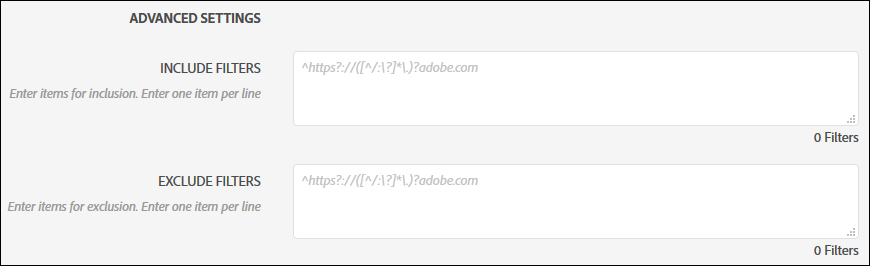
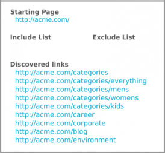
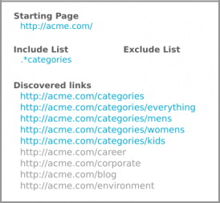
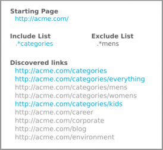
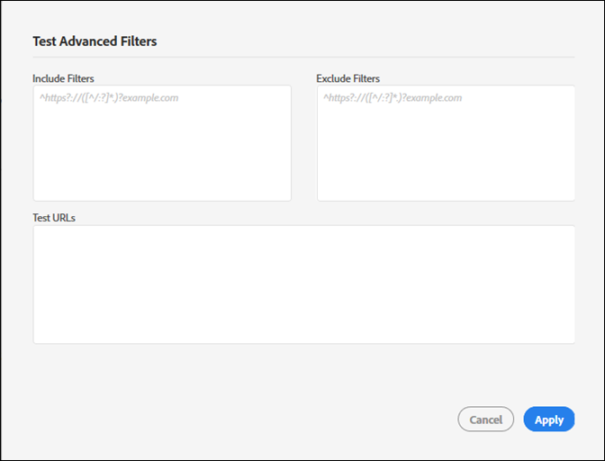

# Include フィルターと Exclude フィルター {#include-and-exclude-filters}

Include フィルターは、Starting URL から監査でクロールできるリンクを制限します。Exclude フィルターは、監査でリンクがクロールされるのを防ぎます。

<!--
Content from ObservePoint (https://help.observepoint.com/articles/2872121-include-and-exclude-filters) with their permission. Modified slightly for style and Auditor emphasis.
-->

Include フィルターと Exclude フィルターは、監査のガイドラインを提供します。Include フィルターと Exclude フィルターを空のままにすると、開始 URL のリンクから始まるすべてのリンクを、監査でクロールできます。



Include フィルター、Exclude フィルター、またはその両方を適用すると、監査でクロールの対象となるリンクに関する指示を提供できます。

[!UICONTROL Include フィールド]の項目は、スキャン対象を、その項目と一致するページのみに制限します。[!UICONTROL Exclude フィールド]の項目は、その項目と一致するページがスキャンされるのを防ぎます。

Include フィルターと Exclude フィルターには、有効なページと一致する完全な URL、URL の一部、または正規表現を使用できます。

## 優先順位 {#section-e9d42419dd3f459bb20e7a33c6104f12}

1. **Starting URL**&#x200B;は、他のすべての項目よりも優先され、監査時には常に訪問されます（URL が Exclude フィルターの項目と一致している場合を含む）。Starting URL は、常に他の URL より前に訪問されます。

   

   上の画像では、監査は開始ページの `document.links` プロパティからリンクを検出します。これらのリンクは、監査によるスキャンの対象となります。

1. **Include URLs** は、開始ページからリンクされている必要があります。リンクされていない場合、URL が見つからず、訪問されません。

   

   上の画像で、Include フィルターを追加すると、フィルターに一致する URL が制限されます。現在は、監査でスキャンできるリンクは 5 つだけです。

1. **Exclude URLs** すると、リンクを対象から削除します。

   

   上の画像では、Exclude フィルターを追加すると、対象のリンクから URL が除外されます。現在は、監査でスキャンできるリンクは 3 つだけです。

## Starting URL {#section-ccb46abcd96f4a8ab171245015d2b724}

Adobe Experience Platform Auditor では、Starting URL に単一のページを指定する必要があります。Starting URL は、常に他の URL より前に訪問されます。開始ページから検出されたリンクは訪問対象となり、Include フィルターと Exclude フィルターが適用されます。「Exclude」項目が Starting URL と一致する場合、その項目は無視されます。

## Include フィルター {#section-7626060a56a24b658f8c05f031ac3f5f}

Include フィルターは、監査時にスキャン対象となるリンクを制限します。Include フィルターには、以下が含まれます。

* 完全修飾 URL
* URL の一部
* 完全な URL または URL の一部と一致する正規表現
* 上記の組み合わせ

Include フィルターに URL または正規表現を含むフィルターに追加しても、監査でこれらの特定の URL がスキャンされるとは限りません。監査では、Starting URL のリンクを調べた後、対象のリンクを順に確認します。監査は、スキャンされた URL の上限（500 個）に達するか、対象のリンクが見つからなくなるまで、この検査と移動のプロセスを続けます。

>[!NOTE]
>
>500 ページのスキャンを完了するまでに最大 48 時間かかる場合があります。

デフォルトでは、監査は Starting URL のすべてのサブドメインをスキャンします。Include フィルターを指定して明示的に上書きしない限り、スキャンでは次の regex include フィルターが使用されます。

`^https?://([^/:\?]*\.)?mysite.com`

これにより、Starting URL ページにあるすべてのリンクが訪問の対象となります。Starting URL から任意のサブドメインのページを照合します。

デフォルトの Include フィルターを使用すると、監査で幅広い範囲をクロールできます。特定のセクションまたはページに移動するには、このボックスにフィルターを追加して、監査に対する具体的な指示を与えます。その場合は、デフォルト値を監査でスキャンするディレクトリに置き換えます。また、Include フィルターを使用して、あるドメインで監査を開始し、別のドメインで監査を終了するクロスドメイン監査を実行することもできます。これをおこなうには、トラバースするドメインを入力します。いずれの場合も、Include フィルター URL を見つけるには、監査対象のページで URL を検出する必要があります。

Include フィルターには、正確な URL、URL の一部または正規表現を含めることができます。例えば、Starting URL が [!DNL http://mysite.com] の場合、次のページはデフォルトでスキャン対象になります（太字に注意してください）。

```html
http://mysite.com
http
<b>s</b>://mysite.com
http://
<b>www</b>.mysite.com/home
http://
<b>dev</b>.mysite.com/home
http://
<b>my</b>.mysite.com/products/products_and_services.html
```

複雑な URL パターンの場合は、[ObservePoint の 正規表現テスト機能](https://regex.observepoint.com/)を使用します。

## Exclude フィルター {#section-00aa5e10c878473b91ba0844bebe7ca9}

Exclude フィルターを使用すると、URL を監査できなくなります。正確な URL、URL の一部または正規表現を含めることができます。Exclude フィルター内の項目と一致する URL は訪問されません。Starting URL が Exclude フィルターに含まれている場合は、除外されません。Starting URL は、常に監査でスキャンされます。

## フィルターと URL のテスト {#section-3cfa125b1756411395a64701e128efa0}

Platform Auditor 内でフィルターと URL をテストできます。

監査の作成時に、「**[!UICONTROL Test Advanced Filters]**」をクリックします。フィルターと URL を入力し、「**[!UICONTROL Apply]**」をクリックします。



## ObservePoint のドキュメント {#section-79cdc8e850d047969b6d2badf6bbd6f9}

この記事は ObservePoint と連携して開発されました。最新の情報については、[ObservePoint のドキュメント]（https://help.observepoint.com/）を参照してください。
