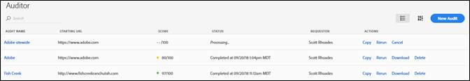
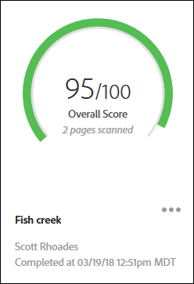
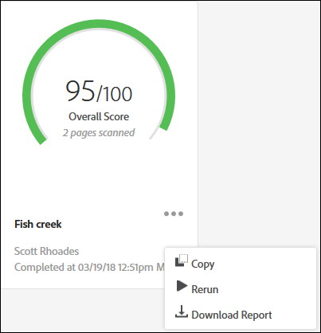

# Audit List ページ {#audit-list-page}

Audit List ページには、すべての監査に関する情報が表示されます。

Adobe Experience Platform監査人を開始すると、監査リストページが表示されます。 Audit List ページは、リスト表示またはカード表示として表示できます。

## リスト表示 {#section-a428749d2ab94a08bf460e6a486b844a}

リスト表示には、監査ごとに次の情報が表示されます。

| 項目 | 説明 |
|---|---|
| Audit name | 監査に与えられた名前 |
| Starting URL | 監査がページのクロールを開始するURL |
| Score | 監査には1 ～ 100のスコアが割り当てられます。100は、スキャンされたページに問題がないことを意味します。 |
| Status | 監査が完了した、または処理中であることを示します |
| Requestor | 監査を作成したユーザーの名前を表示します |
| Actions | Provides links for copying or rerunning the audit, canceling an audit that is currently running, downloading a report as an [!DNL Excel] spreadsheet, or deleting the audit |

監査結果を表示するには、監査の名前をクリックします。

## カード表示 {#section-6826b585e53a46daa722b9bd3eda926e}

カード表示では、各監査がグラフ形式で表示されます。

監査結果を表示するには、監査の名前をクリックします。Click the menu next to the name to see links for copying, rerunning, or canceling the audit, or to download a finished report as an [!DNL Excel] spreadsheet or PDF.

