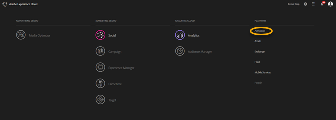
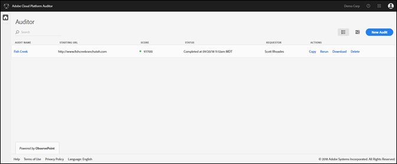
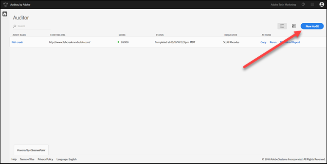
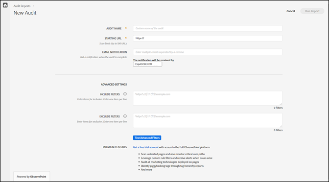
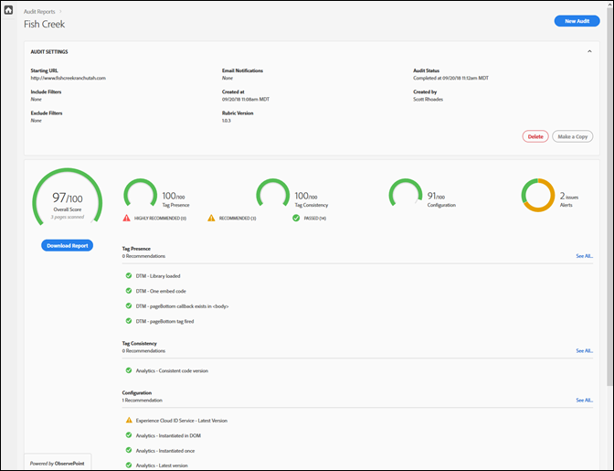

# はじめに {#getting-started}

## はじめに {#task-1024e94b5948413295c9698e62165a04}

<!--
This page is a placeholder for now, we need things like prerequisites, any planning that should be done before using Auditor, initial setup info--that kind of thing.
-->

The first time you use [!DNL Adobe Experience Platform Auditor], you must complete and accept the [!DNL Platform Auditor] agreement. [!DNL Platform Auditor] との間の協力的な取り組みとして開発 [!DNL Adobe] され [!DNL ObservePoint]た Platform Auditorのユーザーは、ObservePointの機能を制限して、追加費用をかけずに使用できます。 Platform Auditorを使用するには、ObservePointからの通信をオプトインする必要があります。

## 最初のスキャンの実行 {#task-b211597afed343cfa238443fcf7c6041}

1. Adobe Experience Cloud ナビゲーションバーの右上隅にあるメニューボタンをクリックし、 **[!UICONTROL Activation]** をクリックします。

   

1. Select **[!UICONTROL Auditor]** and accept the Terms of Use.

   「Platform Auditor」ページには、以前のスキャンのダッシュボードと、新しいスキャンの実行オプションが表示されます。

   

1. **[!UICONTROL New Audit]** をクリックします。

   新しいスキャンを実行するには、画面の右上隅にある **[!UICONTROL New Audit]** をクリックします。

   

1. スキャンを設定します。

   監査に名前を付け、開始 URL を指定して、**[!UICONTROL Run Report]** をクリックします。スキャンが完了したら、電子メール通知を受け取ります。

   

   すべての設定オプションの説明は、[新しい監査の作成](../create-audit/create-new-audit.md)を参照してください。
1. レポートを表示します。

   スキャンが完了したことを知らせる電子メールを受け取ったら、リンクをクリックして[レポートを表示](../reports/scorecard.md)し、実装を改善してアドビのソリューションを最大限活用するための機会について理解します。

   また、[Auditor ページ](../get-started/audit-list.md)で監査の名前をクリックして、監査のステータスを確認したり、監査の完了後にレポートを表示したりできます。

   
