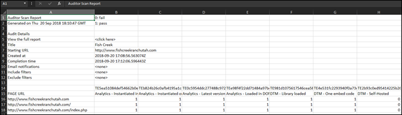

# Download report{#download-report}

このレポートは、各URLが渡されたか失敗したかを示します。

レポートは、ユーザーインターフェイスの[スコアカード]ページで表示できます。 また、次のレポートをダウンロードすることもできます。

1. Auditor リストまたはスコアカードから、「**[!UICONTROL レポートをダウンロード]**」をクリックします。

   レポートはスプレッドシートまたはPDFファイルとしてダウンロードできます。
1. ファイルを開くか、保存するかを指定します。

1. 「**[!UICONTROL OK]**」をクリックします。

   スプレッドシートは、各ページで各テストが合格したか失敗したかを示します。

   

PDFには次の情報が表示されます。

* 監査の設定
* 完了タイムスタンプ
* 全体的なスコア
* カテゴリごとのスコア
* 失敗したURLで適用されたユニットテスト
* テストごとのレコメンデーションとヘルプドキュメントのリンク
