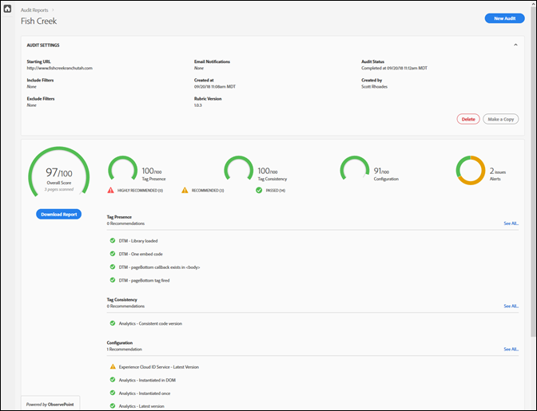
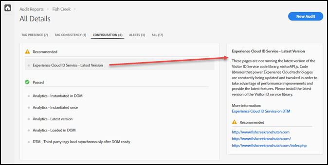

# スコアカード {#scorecard}

テストを実行すると、スコアカードには、監査に関する情報が表示されます。

Adobe Experience Platform Auditor ページで監査の名前をクリックして、テストの結果を表示します。

スコアカードを使用して、次のカテゴリにおける監査のスコアを調べます。

* 総合スコア
* タグの有無

   タグが存在するかどうか、およびタグがページコード内の適切な場所に配置されているかを評価します。
* タグの整合性

   URL をまたいだタグの整合性を評価します。
* 設定

   タグを他のルールおよび推奨ベストプラクティスと比較して評価します。
* アラート

   アラートは、認識する必要があるが、スコアには影響しない問題を示します。

スコアは各テストの重み付けと、合格か失敗かによって異なります。合格すると、スコアはテストの重み付けに等しいポイント数分増加します。

* 0：認識する必要があるが、スコアには影響しない問題を警告します。
* 1：最適化を推奨します。データの正確性には影響しません。
* 2：このテストで不合格となると、Adobe Experience Cloud の最新の機能や修正にアクセスできなくなります。
* 3：効率をテストするとともに、実装が、強く推奨されるベストプラクティスに従っているかどうかをテストします。
* 4：不合格の場合、信頼できないデータを収集する可能性があります。
* 5：不合格の場合、データが失われる可能性があります。

スコアカードには、修正を&#x200B;**強く推奨**&#x200B;する点としてレベル 4 ～ 5 の問題が表示されます。

スコアカードには、修正を&#x200B;**推奨**&#x200B;する点としてレベル 1 ～ 3 の問題が表示されます。

「**[!UICONTROL Download the Report]**」をクリックして、監査によってレポートされた情報を含む [!DNL Excel] または PDF ファイルをダウンロードします。

各カテゴリのスコアに加えて、修正を推奨または強く推奨される点、およびテストに合格した項目がスコアカードに表示されます。それぞれの問題をクリックすると、右側のボックスに追加の詳細が表示されます。もう一度クリックしてさらにドリルダウンし、問題の修正方法に関する推奨事項を確認します。上記のスコアカードにおける推奨される問題の詳細は次のとおりです。

画面上部のカテゴリをクリックして、各カテゴリで見つかった問題を確認します。

## テストの対象となったページはどれですか。{#section-fd38ffeb868648e89c34c5772fa65f46}

テストに合格または不合格となった URL のリストを確認できます。

スコアカードで、テスト名または各カテゴリ見出しの下の「**[!UICONTROL See All]**」リンクをクリックします。これにより、テストの詳細が表示されます。各テストについて、テストの説明と、合格または不合格となった URL のリストを確認できます。この情報は、ダウンロードしたレポートにも含まれます。
